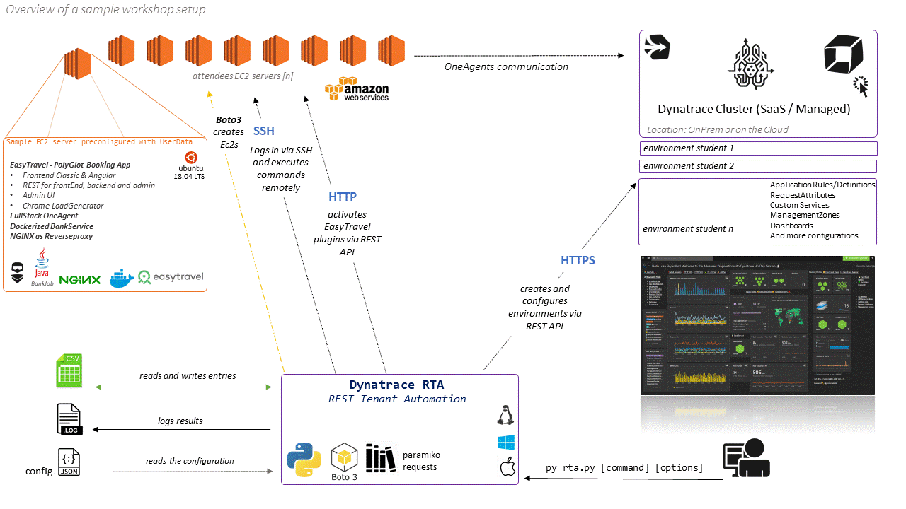
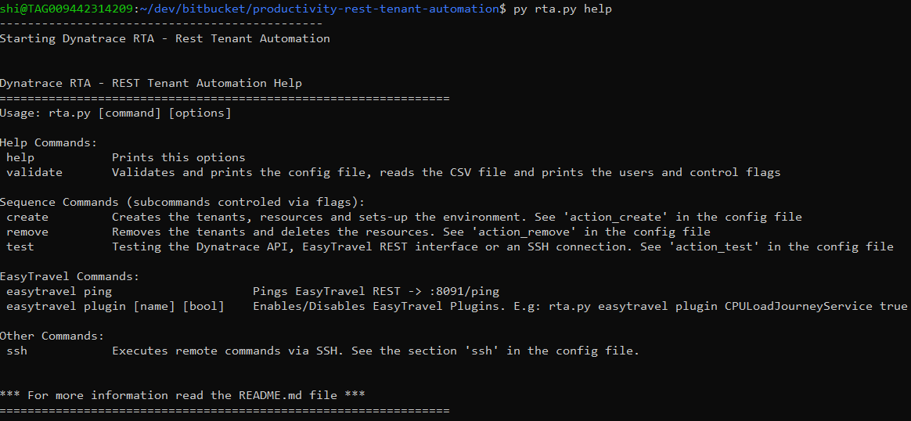

> **DISCLAIMER**: This project was developed for educational purpouses only and is not complete, nor supported. It's publishment is only intended for helping others automate environments for delivering workshops with Dynatrace.

# 🤖🔃👩‍💻Dynatrace RTA - REST Tenant Automation

Python program that creates and automates environments via the Dynatrace API. This small program reads a CSV file and will execute for each entry the command called (or a sequence of commands). Each entry in the CSV file can be controled via flags `skiped=true` as well as the subcommands. The subcommands of the actions `create`, `remove` and `test` can be controled via flags defined in the `config.json` file. This program can work with a Managed Cluster and SaaS environments. 

The program will log the results and write it in the CSV when needed, like if it creates an EC2 instance it will write the `instance-Id`, the `public DNS` and `IP`.

This programm is very powerful for creating and automating environments for workshops. It will set-up an environment as defined with everything preconfigured such as custom dashboards linking them to the user-interface of the deployed applications of the created EC2 machines bein monitored by the OneAgent, ManagementZones, Request-Attributes, Application-Rules and it's definitions. 

#### 🦸‍♂️The Motivation and 💡 idea behind this, is that the 👨‍🎓 student gets everything configured so he spends **more time learning Dynatrace** and not configuring other things trivial to the Topic to learn.

## Overview of a sample workshop setup



## Prerequisites

- [python 3](https://www.python.org/downloads/)

- [A Dynatrace Tenant](https://www.dynatrace.com/trial/?gclid=Cj0KCQiAqNPyBRCjARIsAKA-WFzFj8-YaXYjzaY7uVGj0klG2KnGTs2WaQ8Wg3AI_Z8dX2Fzy9-fOy4aAu5IEALw_wcB)

- AWS account 
  
  > (optional for the ec2-actions) the program (boto3) will look into your `.aws` file for credentials. [Here you can get a free account](https://aws.amazon.com/free/)

## Features in a Nutshell

```properties
- Create and set-up environments with user and user_groups (Managed)
	- Create customized Dashboards for single users
	- Configure Applications and AppRules
	- Auto Tagging rules
	- Management Zones
	- Request Attributes
	- Custom Services
- Connect and execute commands via SSH 
- Enable EasyTravel problem patterns via REST
- Read and write entries in a CSV file
- Write results in JSON format
- Write action results back in the CSV file
	- results of the actions called
	- tenantId
	- ec2 instance id / publicIp / dns
	- tenant token
	- others...
- Logging
- Create an EC2 Instance with custom deployment 🔗 linked to each tenant
	- OneAgent bound to the tenant
  	- EasyTravel (8080/8079), Admin Console (8094) and Angular (9080) configured
- Remove the EC2 Instance and deactivate and remove the tenant.
- Manage the execution with commands via Control RowFlags (true/false) for each row:
	- skip - Skip the row for the actions
  	- isClusterAdmin - to add the User as a cluster admin
- Validate function to read the configuration and print the users in the CSV file. 
```

## Installing RTA

This commands will get you python, pip and the dependencies installed in your system.
```bash
sudo apt install python3

sudo apt install python3-pip

pip install -r requirements.txt
```

After you have installed them, just run `py rta.py help` for printing out the help.



Before running any action is highly recommended that you run the `validate` function so you see the output of the configuration and the entries that will be executed in the CSV file.  

`python3 rta.py validate`


## How does it work?

The `config.json` file:

about the status of the action as well as the id of the tenant, usergroup tenant token, ec2 instanceId, ec2 public dns, etc..<br />The file allows also other custom rows and will not modify them. when rewriting.


```bash
====== [RTA] Rest Tenant Automation Configuration ======
cmc:
 |-cmc_url             : https://xxxxx.dynatrace-managed.com The url of the cluster (when using Managed)
 |-cmc_token           : XXXXYYYYYZZZZ      The API Token of the Cluster. Needed for creating tenants.

csv_dir   : csv
csv_file  : attendees.csv
log_dir   : log
log_file  : rta.log
ssh:
 |-ssh_dir             : ssh
 |-cmd_file            : cmd.sh

aws:
 |-aws_dir             : aws
 |-aws_config          : instance.json


action_test:
 |-tenant_api          : True
 |-ssh_connection      : True
 |-easytravel_ping     : True


action_create:
 |-create_tenant       : True
 |-create_user_group   : True
 |-create_user         : True
 |-create_allinone_token: True
 |-create_ec2_instance : True
 |-fetch_ec2_instance  : True
 |-set_up_env          : True


action_remove:
 |-deactivate_tenant   : True
 |-remove_tenant       : True
 |-delete_user_group   : True
 |-delete_user         : True
 |-delete_ec2_instance : True
```


## TBD List of  CSV keys which are required for SaaS and/or managed

| KEY           | SUB-KEY               | Value                                                                                                                                                                                                                                                            |
| ------------- | --------------------- | ---------------------------------------------------------------------------------------------------------------------------------------------------------------------------------------------------------------------------------------------------------------- |
| cmc           | cmc_url               | The URL of the Tenant (with protocol and no leading slash)                                                                                                                                                                                                       |
| cmc           | cmc_token             |                                                                                                                                                                                                                                                                  |
|               | csv_dir               | the csv directory. In here csv files will be written after an action.                                                                                                                                                                                            |
|               | csv_file              | The csv file to read the information. The program will add rows with information                                                                                                                                                                                 |
|               | log_dir               | The log directory                                                                                                                                                                                                                                                |
|               | log_file              | The log file                                                                                                                                                                                                                                                     |
| aws           | aws_dir               | The AWS directory                                                                                                                                                                                                                                                |
| aws           | user_data             | The file containing the custom deployment. TenantID and TOKEN are variables which will be replaced for each tenant.                                                                                                                                              |
| action_create | create_tenant         | the create tenant action.                                                                                                                                                                                                                                        |
| action_create | create_user_group     | will create a user_group (isClusterAdminGroup) flag will be set if found in the CSV file.                                                                                                                                                                        |
| action_create | create_user           | will create the user and bind it to the user-group.                                                                                                                                                                                                              |
| action_create | create_allinone_token | A token that is allowed to install oneagents as well as read/write configuration and read environment information.                                                                                                                                               |
| action_create | create_ec2_instance   | Will create an EC2 instance for the tenant                                                                                                                                                                                                                       |
| action_create | fetch_ec2_instance    | Will fetch the public dns name of the ec2 instance                                                                                                                                                                                                               |
| action_create | set_up_env            | sets-up the environment. <br />- Modifies the default application<br />- Publish a custom dashboard pointing to the applications deployed in the ec2 instance<br />- Creates a synthetic test.<br />See set_up_environment function for expanding functionality. |
| action_delete | deactivate_tenant     | deactivates tenant                                                                                                                                                                                                                                               |
| action_delete | remove_tenant         | removes the tenant                                                                                                                                                                                                                                               |
| action_delete | delete_user_group     | deletes the user_group                                                                                                                                                                                                                                           |
| action_delete | delete_user           | deletes the user                                                                                                                                                                                                                                                 |
| action_delete | delete_ec2_instance   | deletes the ec2 instance                                                                                                                                                                                                                                         |


## Tenant configuration

Each tenant will end up with its own tenant preconfigured. For expanding the configuration of the tenant take a look at the function *set_up_environment*. This will set up a custom dashboard ponting out to the deployed applications and resources for the session, a custom dashboard, a synthetic test etc.. l. For modifying the template like the dashboard just go to the skel directory and modify the dashboard.json file. 


## Templates

The templates are in the **skel** directory. 

## Get it running

Just type:

```bash
λ py cmc.py help
----------------------------------------------
Starting Dynatrace CMC Tenant Automation


Dynatrace CMC Tenant Automation
=======================================================
Usage: cmc.py <command>
commands: help     = Prints this options
commands: validate = Validates and prints the config file, reads the CSV file and prints the users and control flags
commands: create   = Creates the tenants, resources and sets-up the environment
commands: remove   = Removes the tenants and deletes the resources
** For more information read the README.md file **
=======================================================

```
and prints out the help or to validate and print the config and the users with their control flags type: 

```bash
py cmc.py validate
```

## Control Flags

**skip** = empty and "false" equals false. Meaning the actions defined in the program (command and config file) will be applied to that user. If it contains True then the user will be skipped.

**isClusterAdminGroup** =  empty and "false" equals false. True will set the user_group for the user to cluster_admin. This user will have access to the CMC and to all tenants.


## CSV Fields (mandatory and optional)

The CSV is a semicolon ; separated file.

The order of the fields is not important nevertheless the program will keep the order when rewriting the results of the actions created. The keys are case sensitive.

| Key                 | Mandatory | default Value            | Description                                                              |
| ------------------- | --------- | ------------------------ | ------------------------------------------------------------------------ |
| email               | yes       |                          | the email of the person                                                  |
| firstName           | yes       |                          | the firstname                                                            |
| lastName            | yes       |                          | the lastname                                                             |
| tenantId            | no        | firstName-LastName       | if found in the CSV file can be overwritten                              |
| groupId             | no        | firstName-LastName-group |                                                                          |
| skip                | no        | FALSE                    | If found and if "true", the row will be skipped                          |
| isClusterAdminGroup | no        | FALSE                    | If found and if "true", the userGroup will be added as an cluster admin. |


## AWS Account

The program uses boto3, which is a library for managing aws resources. This will work automatically if you have AWS cli set up in your environment so you dont have to code it or enter it everytime.

[Here is how to set up your environment credentials](https://docs.aws.amazon.com/cli/latest/userguide/cli-chap-configure.html)

You can set them [programatically](https://boto3.amazonaws.com/v1/documentation/api/latest/guide/configuration.html), but I strongly advice to set them in your environment. Be aware that the AMI instance IDs difer from one region to another, meaning an ubuntu has a different AMI ID for "Europe West" than "Europe East". 

## AWS concurrent running instances limit:

By default AWS has a limit of 20 multiple instances running. You might want to check up that limit in the region before creating the EC2 instances.


## How to collaborate

Create branch with the improvement and a pull request. A tip to not forget pushin configuration is marking configuration files in your local repository not to be tracked. You can acomplish this by typing the following git command:
`git update-index --assume-unchanged config.json`


## Ideas for Improvement

- Document the flow of the program.

- make a more generic template to add more actions
- parametrize the creation of EC2 instances in its own JSON file. Most part (except from the user-data) is hard-coded.
- The EC2 instaces due the technical requirements are quite large (size large) and have a 30Gig disk due the installing an ActiveGate with Private Monitors capabilities.

## Author
sergio.hinojosa@dynatrace.com
